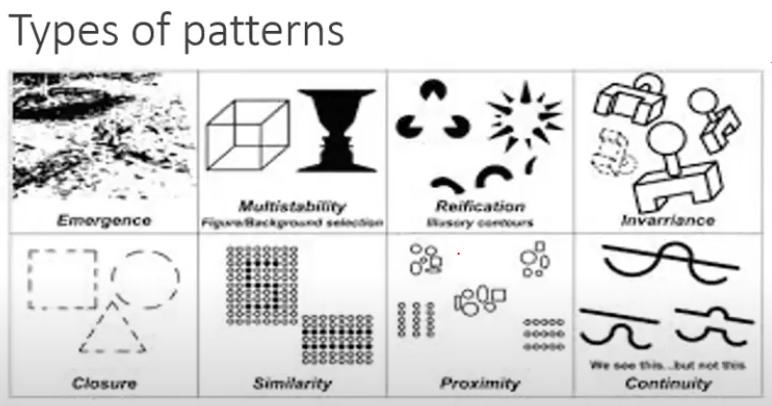
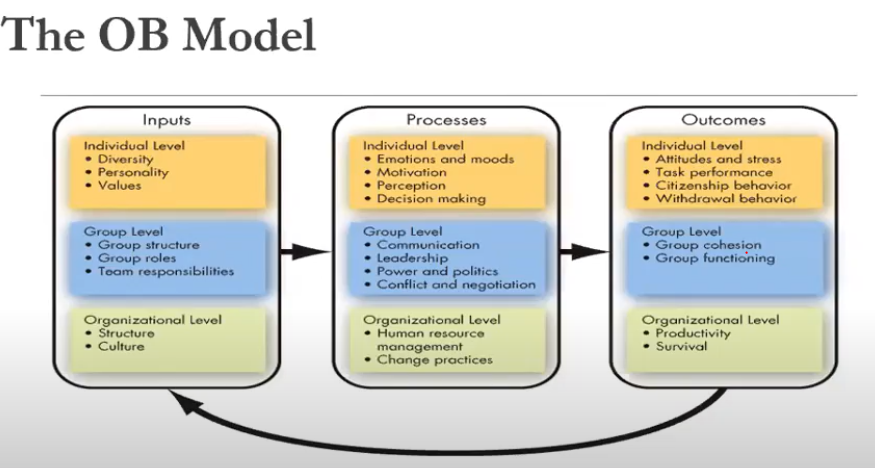
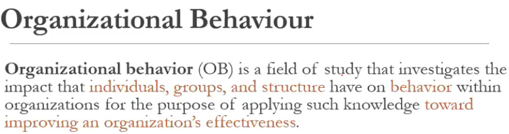
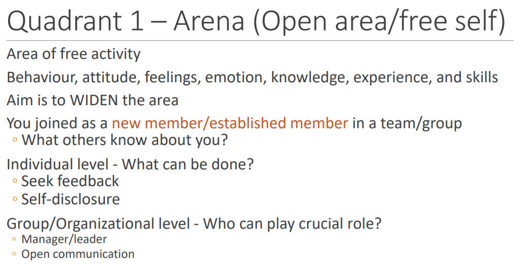
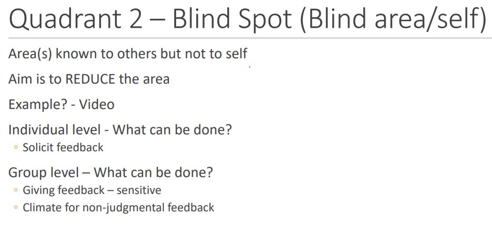
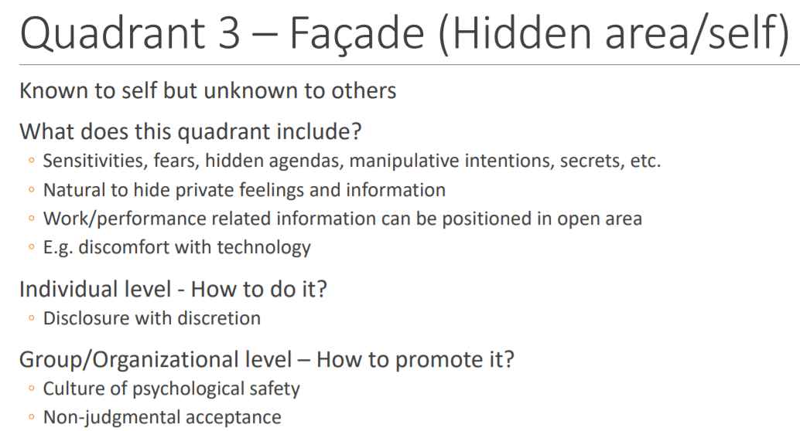
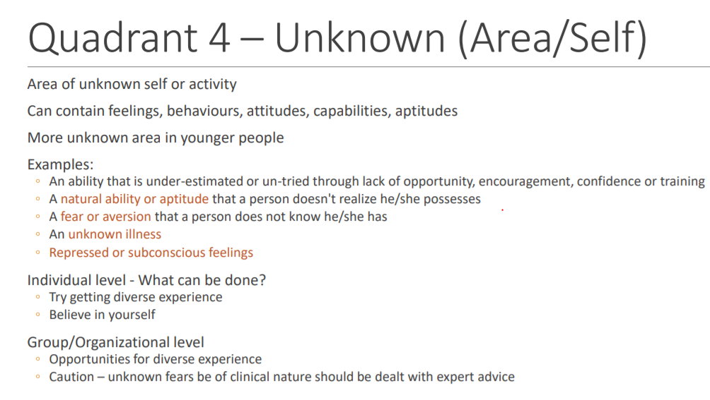

## Psycology
* The science of behaviour and mind 
* Application of science to solve human problems
* Feelings - unobservable | Behaviour - observable actions
* Science is gaining knowledge by observation and experimentation
## Structuralism
* Break down into its constituent elements (sensation/emotions/feelings)
* Method: Introspection
* What questions: "What were you feeling"
* **Problems**  
    * Got all elements but cannot comphrehend well about the function.
## Functionalist
* mind and behaviour is adaptive(perp for exam/ playing..)
* How learning/ memory happens
* Why questions
* **Problems**  
    * No scientific method to determine/ observe mind
## Behaviorism
* Observe - Experiment - Analyse
* Should study behaviour instead of mind
* 3 beliefs of behaviouralist
    * Complex behavious are orn from the pre elementry knwledge
    * Focus on learnd behviour not inbuilt 
    * humans and animals are same
* **Problems**
    * Focuses onnly on behaviour, whats inside mind is missed out 
## Gestalt psycologist 
* Mind works as whole and not in parts
* Mind triesto find patterns

## Organisational Behaviour Model
* Framework: Input, Process, Output
* EG:  
    * **Individual level:** Humans are the inputs, feelings/emotions are process, output is our work
    * **Group Level:** coordination etc
    * **Organisation level:** culture, structure
    
    
## Learning
Relatively permenant change in ones behaviour due to an experience(affecting ones sensory systems)
## Classical conditioning
* Conditioned Stimulus - condition that accompanies natural stimulus
* Unonditioned Stimulus - natural event
* Conditioned Response - behaviour for conditioned stimulus
* Unconditioned Response - how do we react naturally
## Operant Conditioning
* Behvaiour is function of consequences
## Social Learning Theory
* Individuals learn by observing others and gaining experiencing   
* **Vicarious reinforceents** - Not necessary to behave in perticular manner to know output, you can observe and and reinforce some actions
* People respond on how they percieve and define consequences NOT to the objective consequences. **_Can be different_**
## Johari window

## Piaget's Theory
* Children learn by exploring and playing
