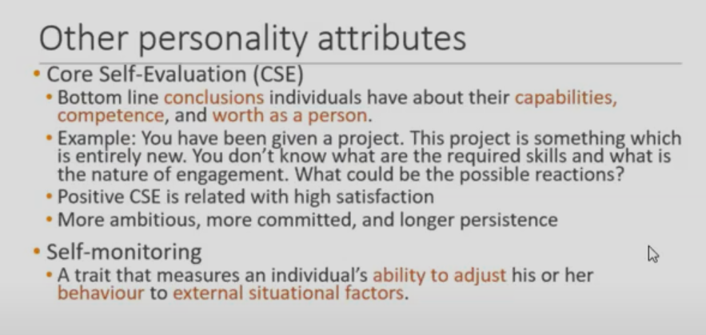
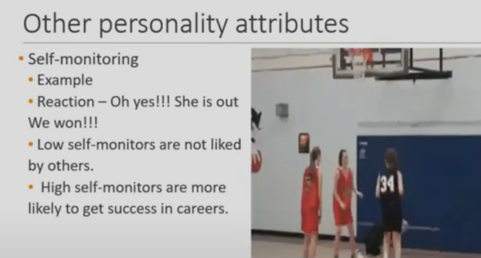
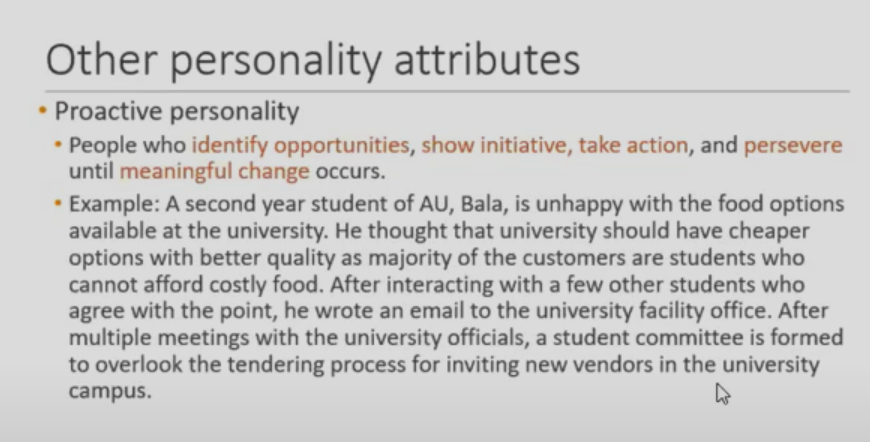
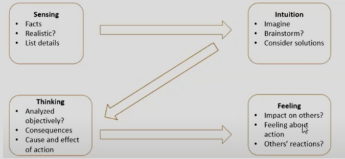
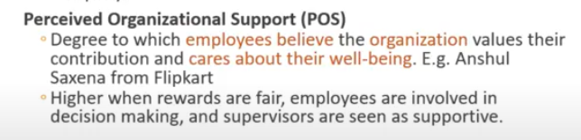
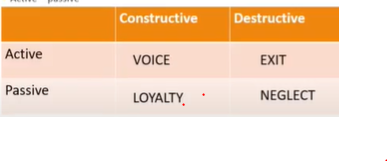

# Personality
## **Summary **
## **Topic**
> personality: sum of ways in which an individulal reacts to and interacts with others personality and infuence the behavior

## How to measure personality??
* to perdict ones behaviour we measure personality
tests to **assess and measure some1s personality**
1. personality tests: 
* self report
    * weakness of self report: we want to be desirable how society percieves to be good, not completely truthful, biases
* observer rating: Only when we have suff exp; 
    * interaction might not be suff enough, 
    * biases, 
    * can take longer time 

## What influences our personality:
1. situation and factors
2. people we are closer toP
3. ENVIRONMENT - 60%
4. HERIDITY - gender reflexes 40%
5. personality traits: stable char. of an individual

# Frameworks - FOR JUDGING PERSONALITY
## Myers-Briggs Type indicator (MBTI) - FOR JUDGING PERSONALITY by letters
1. extrovet vs introvert (E|I)
2. sensing vs intutive(S|N)
- practical, focus on details | uncinciuous opinions
3. thinking vs feeling(T|F)
- high in thinking: use logic | use and focus feelings and emtions
4. judging vs perceptive(J|P)
- need structure: need todo list | flexi and spontanous

it forces indivudual to fit into one of the dimensions

## Big 5 personality model
1. Conscientiousness (Dhoni)
- responsible, dependeble, persistent and organized
are inclined towards OCB: going abv and beyond yr call of duty
2. Emotional stability| opposite: nuroticism
- calm, self confid, can work in changing env
- less chance to engage in counetr work behaviour
3. Extraversion
- sociable, gregarious,assertive(true to  your stand firmly, NOT dominaion)
4. Openness to experience
- to be intellectually curious, creative and imaginative.

*  Agreeableness: cooperative, good natured, trustable
    * less work fam conflict
    * lower carrier success

## Dark Triad
1. **Machiavillianism**
* High and low mac
* It is okay if, by using treachery, deciet, one achieves success.
* High mach people are aggressive.
* Engage in CWB.(counetr productive work behaviour)
* NT good prformance
* Does not predict job performance because of aggressive and are individualistic.
* Not liked by others.
2. **Narcissism**
* Grandiose sence of self importance 
* do nto appreciate feedback wich onflicts with their self perception
* CWB in indivuduaistic cultures not in collective cultures
3. **Psycopathy**
* lack fo concerns for others
* do not empathise
* meausre by compoiance with social norms
## Other personality attributes

# Z- Model
* Before jumping to conclusion or sulution ,

* Research suggests that usually people are high on either of the two and thus must force themselves to look at other two important aspects f this model too

# Situation strength theory
## Factors taht determing strength of situation
1. Clarity: Degree to which cues about work duties and responsibilities are available and clear
* if I am clear in how to behave => Strong situation
* Eg: Nurse, we in 5 star hotel
2. Consistency: Degree to which cues regarding work duties and responsibilities are compatible
* High consistency =>  strong scenario
* nurse(wont put patient life in danger) vs manager
3. Constraints: extent to which freedom to decide acc to his or her own wishes
* org: bank teller(fix work to do) vs professor(varied acc to faculties- less constraints)
4. Consequences
* breaking a law can have huge consequences

> manager - balance the need of situation strength

## Trait Activation Theory
> Trait: stable, takes long time to chane
* Some situations or events activate a trait more than others
* an sales person job,extraversion will be the quality
# Attitudes
* Evaluative statements or judgements about people/object
* Attitude is evaluative statements or judgements about variuos things
* Attitude ALWAYS have feelings associated with it
## 3 components of Attitude
1. Affective: emotional or feeling component
2. Cognitive: opinion or belief segment of attitude
3. Behavioural: intention/ actual to behave towards something

> _Each of the 3 components: affective/cognitive and behavioural have no directionality. Any 2 or 1 can affect other_. Intention to behave might not pass to behaviour (smoking..)
## Relationship between Attitude and behaviour
* Cognitive dissonance: incompatibility between 2 or more attitudes or between behavior and attitude. (Eg: wish to study and wasting time instead)
* How to deal with dissonance/ guilt:
1. Importance - wife children etx: imp to leave smoking
2. Influence - smoking helps me focus
3. Rewards - i wont b able to take intricate detils if i leave. Rewards can get ressonance down  
## Attitude at workplace
* Major attitudes at work place:
1. Job satisfaction - 
* Pay: after comfortable pay amount, other job conditions
* Job conditions: (what kind of autonomy i have, nature of work, independence..)
* **Any value can become antivalue eyond threshold point**: love to possiveness
* Corporate oscial responsibility: Org. actions to benifit society and enviornment - organizational citizenship behaviour(ocb), life satisafaction..
2. Job involvement - 
* degree to which person identifies witha  job
* actively participates in it
* Psycological empowermentL belief on the degree of influence over ones job competence and autonomy
* If i dont work, others wont do as i expected in porject
3. Organizational commitment - identifying with org. + believes his work is reflection of his self identity
* individual is less likely to withdraw themmselves since they are loyal
* Kattapa
4. Engagement
* not satisfied, we engage in other things at job (coffee/washroom etc)
* vice versa
* POS/ Percieved organizational support: how much org valuesand helps
* 
5. Percrived organizational support
_______________________

1. Job satisfaction: positive feeling for our work place
## Measure job satisfaction
1. Amount of work they do 
2. Engagement
3. Productivity
4. Anonymous feedback(Global: how satisfied you are| Detailed: subordinate to asses relationship/culture etc..)
## What if those are not satisfied
* Leave organisation
* Poor performance
* Counter productive work behavior
* Can bad mouth
* Impact- two dimensions

## (CWB) Counter productive work behaviour
* actively damaging organization
* Majorly because of dissaisfaction
* Ceiling: using your office resources for personal or phone while working 
* solution :
    * Craeting teams
    * Clearing proper policies
    * Remove the ideas of injustice
    * Try promoting teams and not indiivduals
1. Dissatisfaction with absentism: (+)ve realtionhsip
* Higher in those areas where num of jobs are higher
* coz they will switch their mind
2. Turnover 
* Push pull effect
* Push : very dissatisfied and already searching for jobs
* Pull : dissatisfied but not searching for any other job, but you get an external call and thus you leave
> Fatima case: she moulded her job according to her requirements.
_____________________________________________________________________
