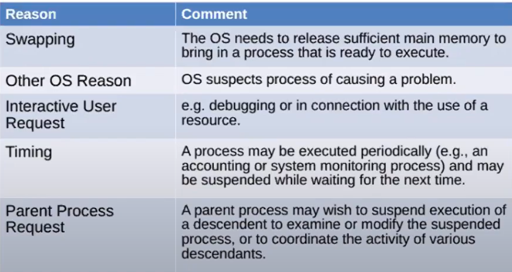

## Suspended Process (5-state)
* It is possible that at one point _all the processes are waiting_ for I/O and processor will remain idle.
* Issues to address
    * Processor could be idle most of the time.
* Solution
    * **Swap these processes to disk to free RAM and execute some new processes**.
* Blocked state, thus, becomes suspend state when swapped to disk.
* Now 5-state gets converted to 6-state model

## 6-state model
* 
* Notice that blocked processes are transferred to suspended processes BUT suspened processes are **directly** transfered to ready state.
* OS now has two ways to bring process in main memory
    * Admit new processes
    * Activate previously suspended processes
* Subsets of suspend state
    * Blocked/Suspend: Process in secondary memory and awaiting an event.
    * Ready/Suspend: In secondary mem but available for execution as soon as brought in main memory

## 7-state model
* 
* If memory is not available, new process can be admitted into ready/suspended memory
* Newly created process will remain in ready/suspend state until there is memory avaible to move it to ready state.
* Eg. When booting up, memory is awailable and hence it is possible to directly admit new process into ready state.
* New state transitions

* Block suspend to block: then OS thinks that higher priority block suspend process id going to happen in near future, it will bring BS process to B

## Characterisitcs of suspended processes
* Process not immediately available for execution because 
    * No enough mem to bring in ready state from ready suspend
    * Is in block suspend state
* It may or may not be waiting for an event(RS or BS states)
* "Agent" puts the process in suspended state. Agents include either itself (Eg. Some process which occur only periodically), parent procees or OS in order to preclude its execution.
* Process may not be removed until agent orders the removal. Most of the time agent is OS.

## Reason for process suspension
* 

## Relation between process and resource
> Recap: OS is a resource manager. Process is a program in execution.

* **Main memory is also a resource means**
* Virtual memory is extention of secondary memory into main memory.
* Some part of HDD is considered in RAM.

# Data Structures for OS
* OS must have information about current status and all processes and all resources.
* Thus, OS maintains tables for each of the functionalities it offers
## Memory Table
* Keep tracks of main and secondary memory.
* Must include information
    * Allocation of main memory to processes.
    * Allocation of secondary memory to processes.
    * Protection attributes for access to shared memory regions.
    * Information required to manage virtual memory.
## I/O Table
* Manage I/O device and channels of computer.
* Must include information
    * Availability of I/O device.
    * Status of I/O operation whether I/O device is available or not.
    * Location in main memory for source and destination
## File Table
* Must include information
    * Existence of files.
    * Location on secondary memory.
    * Current Status.
    * Others (Who can access? Readable or writable? etc.)
## Process Table
* Must include information
    * Location of **process** in the memory.
    * Process attributes.
* Memory, I/O and files are managed on behalf of processes, so there has to be some reference to these resources in process tables. (Like foreign key)

____________________________________________________________________________

## Physical manifestation of a process
> Menifestation means presentation.

* Elements of **Process Image** aka memory
    * User Data
    * User Program
    * User Stack
    * Process Control Block (PCB)

## Process Location
* It is not required in main memory. Someting called virtual memory also exists.
* Process image is maintained as a contiguous block of memory (**in secondary memory**) 
    * **_EXCEPT_** PCB it is in main memory.
* Maintained in secondary memory (majority of its part).
* Some part should be loaded in main or at least in virtual memory.
* Moreover, to execute process, program must be in main memory even in pages form.
* Thus OS needs to know which parts of process are in main and secondary memory and at which location.
> Paging system: The memory is divided into chunks

## 3 general Attributes in PCB
* Process identification
* Processor state information
* Process control information

## Process Identification
* Identifier of this process.
* Identifier of parent process.
* User identifier (To which user this process belongs to?)

## Processor state information
> Processor state is always **stored in register.**

* User Visible registers
    * Most of the times they are the address registers and data registers
    * It means that these registes can be directly visible by programs running in user-mode.
    * Generally they are 8-32 regsiters but some RISC implementations may have over 100.
* Control and status registers
    * Program counter - Contains address of the next instruction.
    * Condition codes - Result of the most recent ALU operation.
    * Status information - Contains inturrept flags and execution mode (They are also known as program/process status mode).
* Stack Pointers (Registers)
    * Process image uses stack to maintain parameters and calling addresses for procedures and system calls.
    * There could be multiple stacks and each stack has a stack pointer pointing to the top of the stack.

## Process control information
> Manages additional information that is needed by the OS to control and coordinate the various active processes.

* These include the following
    1. Scheduling and state information
    2. Data Structuring
    3. IPC - Inter-process communication
    4. Process Privilleges
    5. Memory Management
    6. Resource Ownership and Utilization 
    * Process privileges includes "What area can be accessed by the process" or "Which mode?" etc.
* Scheduling and State information
    
* Data Structuring
    *  
    * For each state (blocked, ready etc.) there would be one queue and generally they are made using linked list.
* IPC
    * 
    * It occurs when two process talk to each other
* Process privileges
    * 
    * What kind of file, area of memory etc.
* Memory Management
    * 
* Resource Ownership and Utilization
    * 
> ## What does Process image contain?
* 

## Role of PCB
* It is the most important DS.
* It contains most of the information regarding a process excpet stack pointers.
* It manages the processes.
* Thus, it requires protection.
    * If not done then,
        * It may damage the block and destroy OS's ability to manage the processes.
        * Any change in design will affect many other modules of OS.

