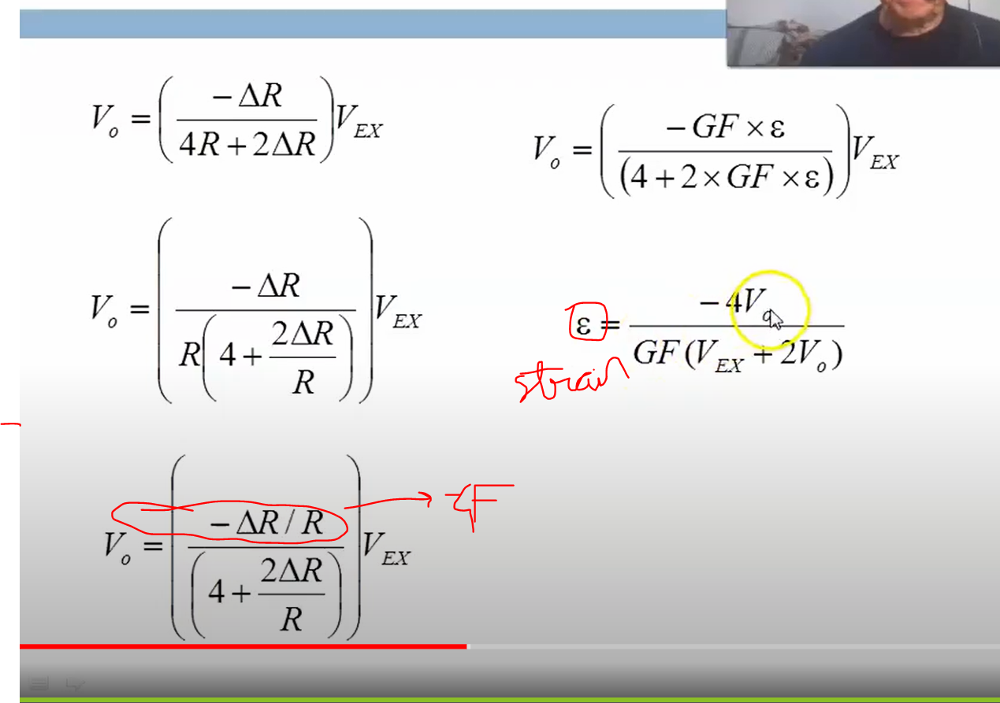

* **Transducers** : 1 type of signal to another
* **Signals** : Non electrical to electrical signal 
    * Sub part of transducer
    * Sensor is either voltage or current
*  Strat pulse, End of conversion(EOC) - Analog to digital convertor(ADC) will need some time to convert.
* **Primary standards** - Highly accurate instruments, unaffected by temp, etc..
* Types of errors
    1. Systematic - occures every time, 0.1 accuracy error in machine
    2. Random - Human errors, non repeated
    3. Standard error - measures how much discrepancy is likely to be in sample mean and population mean
    
* Know the difference between accuracy and precision

* **Span** - Linear operating range
* **Range** -  The range of measurable values
* Linearization of sensors - get best fit line since they will always have some non linearity

* Max deviation = MAX | ymi - yfi | 
* Ym is measured, Yf is fitted value

 

 
## Potentiometer as position transducer/sensor
- (Potentiometer used ot snece position)

## stress and strain
 * when you apply force, the object id free to move.
 * If not free, then deformed
 * Hook's law: F = delL * k
    * F = force applied
    * K = constant depending on shape and composition of the matter
    * delL = delta L = amount of deformation
* F vs delL is linear onky when smaller deformation
* Elastic region, force removed, back to normal shape
* Permenant deformation
* Fracture
## Axial and transverse strain
* Tensile force from top and botton **pull**
    * Length incr
    * Diameter decr
* Compression
    * Length decr
    * Diameter incr
 

* Stress = force F
* Strain = DelL/L
* constant K = youngs moduluous* area

* To study strain,
we have this formula:

## Principles of Force sence resistor
* When compress: resistence decreases
